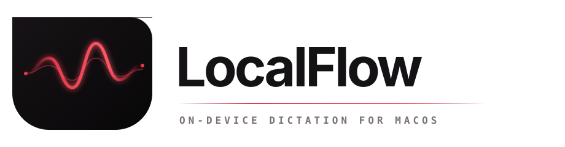

<p align="center">
  
</p>

<p align="center">
  Fast, private, on-device dictation for Apple silicon Macs.
</p>

<p align="center">
  
  
  <a href="LICENSE"></a>
</p>

LocalFlow turns speech into polished text at the active cursor without sending audio or transcripts to a cloud service. Hold <kbd>⌥ Option</kbd> + <kbd>Space</kbd>, speak, and release. Apple SpeechTranscriber handles transcription and Apple Foundation Models can clean the result before LocalFlow pastes it into the focused app.

## What it does

- Streams speech recognition locally with Apple SpeechTranscriber.
- Uses Apple Foundation Models for optional two-second smart cleanup.
- Falls back to the raw transcript if cleanup misses its deadline.
- Pastes safely into the currently focused text field.
- Keeps listening and processing in a 170 × 38 waveform-only notch. Dictation auto-pastes into a focused text field; without an editable target, the notch expands with Copy and History.
- Keeps unlimited, searchable transcript history in a user-private local SQLite database.
- Supports click-to-start/stop, push-to-talk, Reduce Motion, and a persistent 220–420 pt expanded-HUD width.
- Never persists audio, prompts, or clipboard contents. Transcript history is stored only on your Mac and can be cleared at any time.

## Requirements

- Apple silicon Mac (MacBook Air, MacBook Pro, Mac mini, Mac Studio, or iMac)
- macOS 26.0 or newer
- Xcode 26 or the matching Swift 6.2 command-line tools
- Microphone, Speech Recognition, and Accessibility permissions

## Install

Start with [SETUP.md](SETUP.md). On a new Mac, the guided flow is:

```bash
git clone https://github.com/codejunkie99/LocalFlow.git
cd LocalFlow
./scripts/setup-localflow.sh
```

This installs one canonical signed copy at `~/Applications/LocalFlow.app` and preserves permissions across updates with a stable per-Mac signing identity.

## Quick start

```bash
git clone https://github.com/codejunkie99/LocalFlow.git
cd LocalFlow
./scripts/package-app.sh
open dist/LocalFlow.app
```

For a full first-run walkthrough, see [Installation](docs/INSTALL.md).

## Use

1. Focus a text field in Notes, TextEdit, Safari, Slack, or your editor.
2. Hold <kbd>⌥ Option</kbd> + <kbd>Space</kbd>.
3. Speak naturally.
4. Release the keys to transcribe, optionally clean up, and paste.

A quick tap of the shortcut enables toggle mode: tap once to start and again to stop. You can also use **Start Dictation** from the LocalFlow menu-bar menu.

## Privacy model

- No transcript content is uploaded or logged.
- Audio exists only in memory while recording.
- Transcript history is stored locally at `~/Library/Application Support/LocalFlow/history.sqlite3` for the current user only.
- Use **Clear Transcript History** in LocalFlow to permanently delete saved transcripts; permissions and settings are unchanged.
- Cleanup prompts and clipboard snapshots are never persisted.
- Logs contain state and timing information only.
- Clipboard contents are restored after the paste attempt when possible.
- Apple may download system-managed speech and language-model assets.

For first-run setup on a new Mac, start at [SETUP.md](SETUP.md). See [Architecture](docs/ARCHITECTURE.md) for the trust boundaries and data flow.

## Update

Use **Update LocalFlow** from the LocalFlow menu. It checks the newest tagged source release only when you ask, verifies the manifest/checksum/archive, builds with the same per-Mac signing identity, backs up history, and replaces `~/Applications/LocalFlow.app` with rollback safety. There is no background updater. Maintainers publish source releases with `./scripts/publish-source-release.sh`; a notarized DMG is a later distribution layer for when Developer ID credentials exist.

## Build and test

```bash
swift build --disable-sandbox
./scripts/run-tests.sh
```

Create a release application bundle:

```bash
./scripts/package-app.sh
```

Use a specific signing identity when needed:

```bash
LOCALFLOW_SIGNING_IDENTITY="Apple Development: Your Name (TEAMID)" ./scripts/package-app.sh
```

Stable signing lets macOS keep the Accessibility grant across rebuilds. An ad-hoc signature is fine for a quick local build, but macOS may ask for Accessibility again after the executable changes.

## Performance target

For 20 warm trials:

- Median total latency: ≤ 1,500 ms
- p95 total latency: ≤ 2,500 ms
- Paste latency: ≤ 100 ms

Use `artifacts/performance/acceptance-template.json` with `scripts/acceptance-stats.sh` to record a local run.

## Project layout

```text
Sources/LocalFlowApp       SwiftUI menu-bar app and notch HUD
Sources/LocalFlowCore      State machine, deadlines, and privacy-safe policies
Sources/LocalFlowPlatform  Apple Speech, Foundation Models, shortcut, and paste adapters
Tests                      Deterministic core and platform checks
scripts                    Build, package, test, and acceptance helpers
```

## Contributing

Bug reports and focused pull requests are welcome. Read [CONTRIBUTING.md](CONTRIBUTING.md) before making changes. Security and privacy issues should follow [SECURITY.md](SECURITY.md).

## License

LocalFlow is available under the [MIT License](LICENSE).
